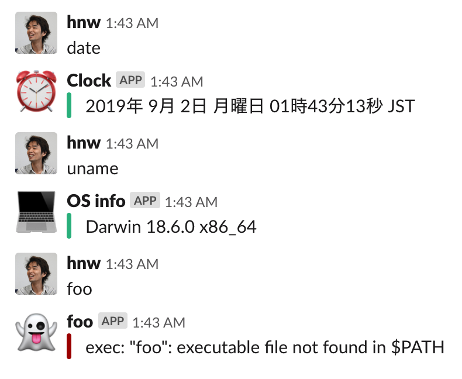
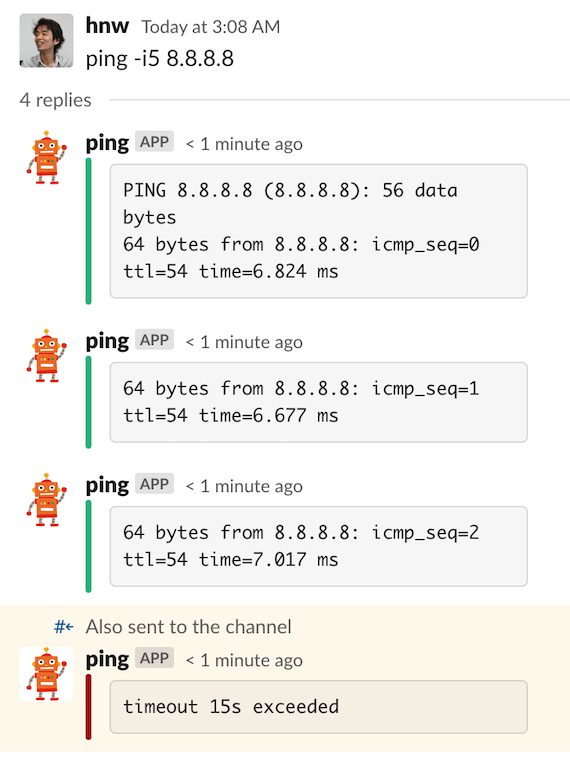

# slack-commander

Slackチャンネル内で発言されたキーワードに応じて外部コマンドを実行し、その結果をSlackにポストするSlack botです。

設定はTOMLで記述します。

コマンドラインツールなら何でもSlackから扱えるようになるので、好きなプログラミング言語でSlackの機能拡張を行うことができます。また、このbot1つで任意個のコマンドを起動できるので、Slackのbotユーザー数を消費せずに複数の機能を実現できます。

外部コマンドの標準出力は無害っぽい色で、標準エラー出力は危険っぽい色でSlack上に表示します。



## 特徴

 * コマンドの終了を待たずにコマンドの出力をSlackにポストします
 * 外部コマンドの最大並列数やタイムアウト時間を指定できます
 * リマインダーやbotの発言を元にコマンド起動させることができます
 * コマンドの実行結果をスレッド化してポストすることができます
 * コマンドごとにアイコンやユーザー名を変えることができます



## インストール&実行

```
go get -u github.com/hnw/slack-commander
cd $GOPATH/github.com/hnw/slack-commander
cp config.toml.example config.toml
vi config.toml
./slack-commander
```

## 設定

設定ファイルは同一ディレクトリの `config.toml` です。

### slack_token

SlackのOAuthトークンを指定します。

### num_workers

外部コマンドの最大並列数を指定します。

### accept_reminder

Reminderの発言もキーワードマッチの対象にする（`cron`や`at`の代用になります）

### accept_bot_message

Botの発言もキーワードマッチの対象にする

### accept_thread_message

返信（スレッド内）の発言もキーワードマッチの対象にする

### keyword

マッチするキーワードを指定します。キーワードにはワイルドカード `*` を含めることができます。

指定したキーワードのうち2つ以上にマッチする場合、先に定義した方が採用されます。

### command

キーワードにマッチした場合に起動するコマンドを指定します。

ワイルドカード `*` が指定された場合、キーワードの `*` にマッチした内容が展開されます。

### icon_emoji

botがSlackにポストする時のアイコンをSlack絵文字で指定します。

### icon_url

botがSlackにポストする時のアイコンをURLで指定します。

### username

botがSlackにポストする時のユーザー名を指定します。

### monospaced

コマンドの出力を等幅フォントで表示します。

### post_as_reply

コマンドの出力をスレッド形式でポストします。

### always_broadcast

コマンドの出力をスレッド形式にした場合に、チャンネルにもポストします。

### timeout

外部コマンドのタイムアウト時間を秒で指定します。
