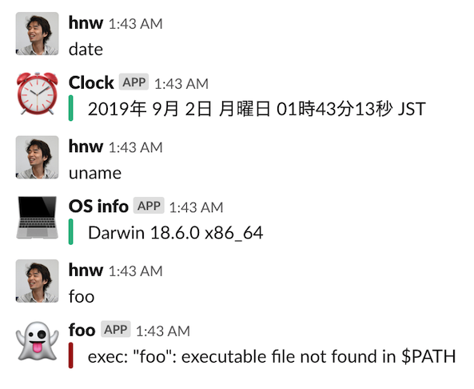

# slack-commander

Slackチャンネル内で発言されたキーワードに応じて外部コマンドを実行し、コマンドの出力をSlackにポストするSlack botです。

コマンドラインツールなら何でもSlackから扱えるようになるので、好きなプログラミング言語でSlackの機能拡張を行うことができます。

また、このbot1つで任意個のコマンドを起動できるので、Slackのbotユーザー数を消費せずに複数の機能を実現できます。

## 実行例



## 特徴

 * Slackチャンネル内の発言中のキーワードに応じて外部コマンドを起動し、コマンドの出力をSlackにポストします
 * 間欠的に出力するようなコマンドの場合、コマンドの終了を待たずにコマンドの出力をSlackにポストできます
 * 外部コマンドの最大並列数やタイムアウト時間を指定できます
 * リマインダーやbotの発言を元にコマンド起動させることができます
 * コマンドの実行結果をスレッド化してポストすることができます
 * コマンドごとにアイコンやユーザー名を変えることができます

## インストール&実行

```
$ go get -u github.com/hnw/slack-commander
$ cd $GOPATH/src/github.com/hnw/slack-commander
$ cp config.toml.example config.toml
$ vi config.toml
$ go build
$ ./slack-commander
```

ビルドにはGo 1.12以降が必要です。

## 設定例

[config.toml.example](./config.toml.example)

## 設定の詳細

### slack_token

SlackのOAuthトークンを指定します。

### num_workers

外部コマンドの最大並列数を指定します。

### accept_reminder

Reminderの発言もキーワードマッチの対象にする（`cron`や`at`の代用になります）

### accept_bot_message

Botの発言もキーワードマッチの対象にする

### accept_thread_message

返信（スレッド内）の発言もキーワードマッチの対象にする

### keyword

マッチするキーワードを指定します。キーワードにはワイルドカード `*` を含めることができます。

指定したキーワードのうち2つ以上にマッチする場合、先に定義した方が採用されます。

### command

キーワードにマッチした場合に起動するコマンドを指定します。

ワイルドカード `*` が指定された場合、キーワードの `*` にマッチした内容が展開されます。

### icon_emoji

botがSlackにポストする時のアイコンをSlack絵文字で指定します。

### icon_url

botがSlackにポストする時のアイコンをURLで指定します。

### username

botがSlackにポストする時のユーザー名を指定します。

### monospaced

コマンドの出力を等幅フォントで表示します。

### post_as_reply

コマンドの出力をスレッド形式でポストします。

### always_broadcast

コマンドの出力をスレッド形式にした場合に、チャンネルにもポストします。

### timeout

外部コマンドのタイムアウト時間を秒で指定します。

## 参考：systemdで管理する例

botとして半永久的に動かしたい場合、デーモン管理ツールで管理するのがオススメです。

ここではsystemdで管理する例を示します。まず、`/etc/systemd/system/slack-commander.service`を作成しましょう。

``` ini
[Unit]
Description = slack-commander
After=network-online.target
Wants=network-online.target

[Service]
User = pi
Group = pi
WorkingDirectory = /opt/slack-commander/
ExecStart = /opt/slack-commander/slack-commander
ExecStop = /bin/kill ${MAINPID}
Restart = always
Type = simple

[Install]
WantedBy = multi-user.target
```

下記コマンドでbotとして動作しはじめます。

``` 
# systemctl start slack-commander.service
```

しばらく動かしてみて問題なさそうなら自動起動させるようにしましょう。

``` 
# systemctl enable slack-commander.service
```
