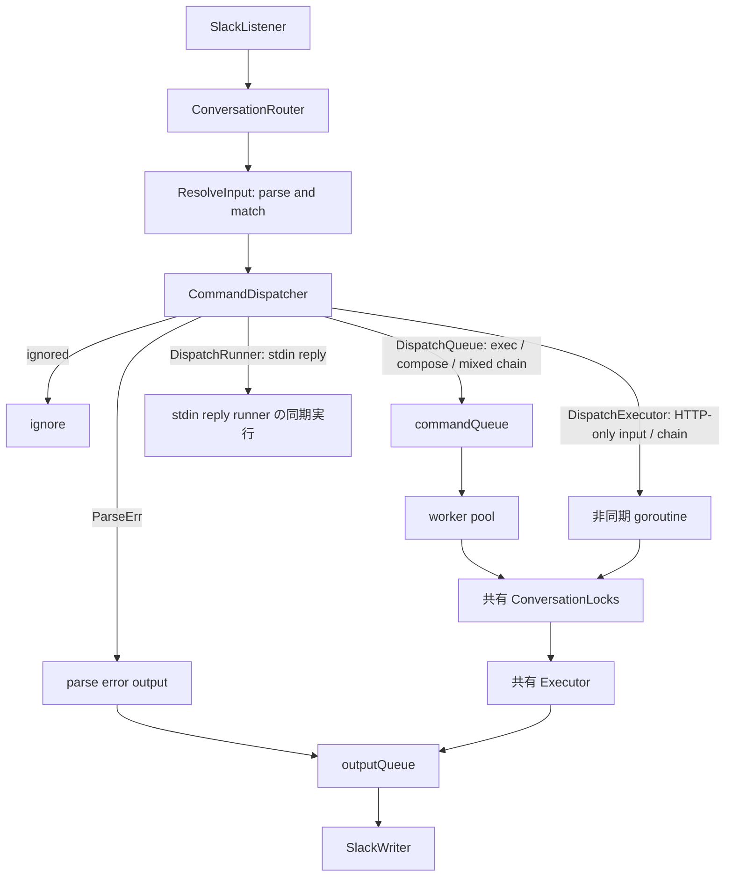

# 内部実装について

## goroutine と channel の関係図

Resolverは入力をparseしてpartごとにcommandを照合します。parse errorがある場合はDispatcherが実行経路を選ぶ前にerrorをoutputQueueへ送り、先頭partがunmatchedなら従来どおり無出力で終了します。
parse errorは`SystemReplyConfig`付きの`CommandOutput`として`ExitCode=2`で送られます。実行前の入力エラーなので`Spawned`と`Finished`は出しません。
各commandの`CommandConfig.Dispatch`は`DispatchMode`（`DispatchQueue`、`DispatchExecutor`、`DispatchRunner`）で実行方法を示し、`DispatchQueue`はゼロ値です。Dispatcherは先頭partの一致とparse errorを確認し、parse errorがない複数part入力では全matched commandの`AllowInChain`を確認してから`ResolvedInput.DispatchTarget()`で実行経路を決めます。後続partの未一致はExecutorでcommand not foundとして扱います。`DispatchRunner`の複数part制約も維持します。
Routerは明示的な返信routingに使うCommandだけをroute cacheへ保存します。stdinを含むrootはexplicit replyをnegative cacheし、history復元でもreply用Commandを選べないrootとして扱います。thread replyではRouterが同じ`StdinStore`からactive endpointと、そのendpointを生成したstdin commandの暗黙返信Commandを一括で取得し、そのCommandだけで候補indexを照合します。受理した返信には同じentryのendpointを`CommandInput`の内部runtime fieldへ保持し、direct stdin reply Cmdへ渡します。active endpointがない場合だけ、cache/historyで選んだexplicit replyを使います。Executorは各commandの`InteractiveStdin`設定に応じてendpointと暗黙返信Commandを一括登録します。DispatcherとRouterのroot資格判定は同じ副作用なし実行計画を使います。
通常のcommand executionは必ずExecutorを通します。DispatcherはExecutorへ渡す方法として、worker queueを経由する`DispatchQueue`と、queueを使わない`DispatchExecutor`を選びます。
exec / composeを含む入力は`DispatchQueue`でworker poolへ送ります。HTTPだけで構成された入力は、単一commandでもchainでも全体を1回のExecutor呼び出しとして非同期実行し、通常のcommandQueueが満杯でも受理します。
stdin replyは既存executionへの入力配送でcommand executionではないため、`DispatchRunner`としてExecutorを介さずrunnerへ直接渡します。stdin interactionはchain内でも利用でき、返信のACLとmatcherは現在active endpointを生成したcommandの暗黙reply Commandに従います。
ExecutorはDispatcherが受理したresolve済みcommand / chainの実行だけを担当し、parse errorを出力せず、`AllowInChain`の判定も行いません。

workerと`DispatchExecutor`のgoroutineは同じConversationLocksとExecutorを使います。
異なるconversationのHTTPはworker数に関係なく並列実行できますが、同じconversationのcommand実行は直列です。
待機順は厳密なFIFOではありません。
stdin replyは実行中commandへの入力なので、conversation lockを待たずに同期実行します。

終了時はlistenerの停止を待ってからDispatcherを閉じ、新しいdispatchを拒否します。
commandQueueを閉じてworkerの終了を待ち、次に非同期HTTPの終了を待ってからoutputQueueを閉じます。
SlackWriterは残りの出力を処理して終了します。
DispatcherのCloseと非同期WaitGroupへのAddは同じmutexで保護し、Close後にWaitを呼びます。Waitは非同期Executor実行とparse error出力の両方を待ちます。
