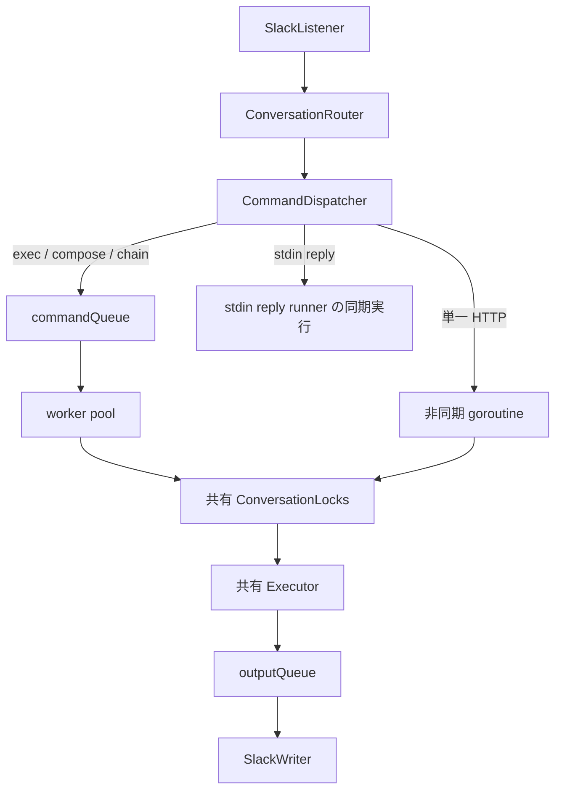

# 内部実装について

## goroutine と channel の関係図

Routerはcommandの照合とroot ownershipのキャッシュを担当し、Dispatcherが実行先を選びます。
単一のHTTPコマンドはroot入力と返信の両方で非同期実行し、通常のcommandQueueが満杯でも受理します。
HTTPを含むチェーンは、全体を従来どおりworker poolで実行します。

workerとHTTP goroutineは同じConversationLocksとExecutorを使います。
異なるconversationのHTTPはworker数に関係なく並列実行できますが、同じconversationのcommand実行は直列です。
待機順は厳密なFIFOではありません。
stdin replyは実行中commandへの入力なので、conversation lockを待たずに同期実行します。

終了時はlistenerの停止を待ってからDispatcherを閉じ、新しいdispatchを拒否します。
commandQueueを閉じてworkerの終了を待ち、次に非同期HTTPの終了を待ってからoutputQueueを閉じます。
SlackWriterは残りの出力を処理して終了します。
DispatcherのCloseと非同期WaitGroupへのAddは同じmutexで保護し、Close後にWaitを呼びます。
