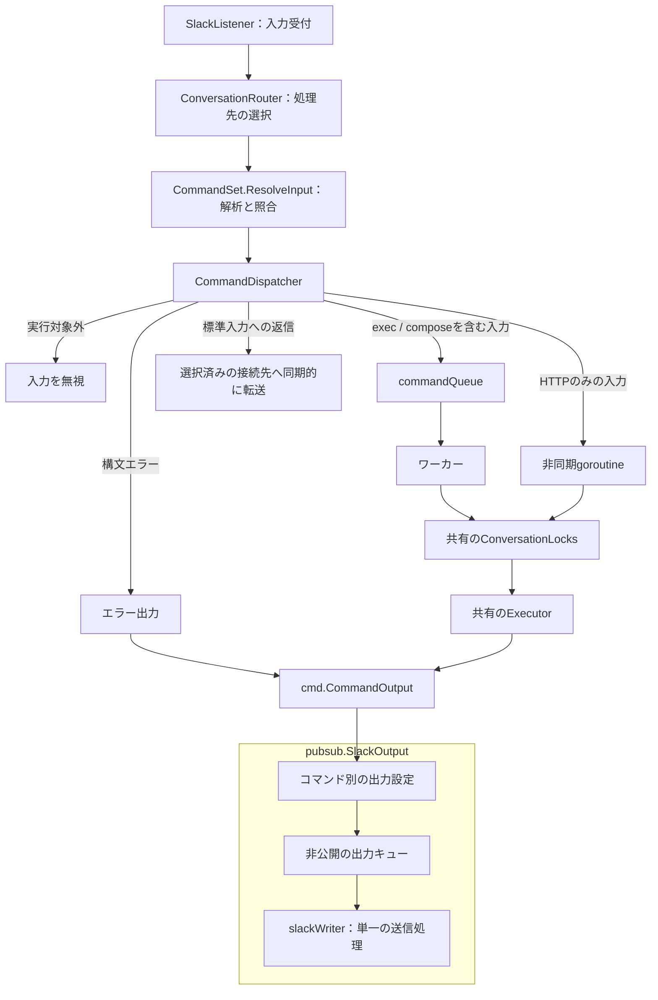

# 内部構造

slack-commanderは、Slackからの入力受付、コマンドの照合、実行先の選択、実行、Slackへの出力を分担しています。
`main`が各オブジェクトを生成し、共通の状態を使う処理同士を接続します。

## 各型の責務と所有する状態

| 型または処理 | 責務 | 所有する主な状態 |
| --- | --- | --- |
| `SlackListener` | Slackイベントの受信、入力の正規化、許可設定に基づく候補の絞り込み | botの識別情報は現在、`pubsub`のパッケージ変数に保持 |
| `CommandSet` | 入力の解析と、候補の中からのコマンド照合 | 照合対象となる`Command`の一覧 |
| `Command` | 一つのコマンドに必要な設定と実行手段をまとめる | 設定、Matcher、Runner、出力先、返信用の`CommandSet` |
| `ConversationRouter` | 起点メッセージとスレッド返信の処理先を決める | 明示的な返信用コマンドを選ぶためのキャッシュ |
| `CommandDispatcher` | 解決済みの入力をキュー、非同期実行、標準入力への転送に振り分ける | 受付終了フラグと非同期処理の待ち合わせ |
| `Executor` | 解決済みのコマンドやコマンドチェーンを実行する | インスタンスには状態を持たず、タイムアウトや入出力を実行ごとに管理 |
| `StdinStore` | 実行中プロセスの標準入力への接続先を管理する | 会話ごとの接続先と、その接続先に対応する暗黙の返信用コマンド |
| `ConversationLocks` | 同じ会話のコマンド実行を直列化する | 会話ごとのロック |
| `SlackOutput` | コマンドの出力を受け取り、Slackへ順に送信する | 出力イベントのキュー |

ここでいう会話は`ConversationID`で識別します。
Slackでは、チャンネルIDとスレッドの起点メッセージのタイムスタンプの組に対応します。

返信用コマンドには、設定ファイルの`[[commands.replies]]`で定義するものと、`interaction = "stdin"`で内部的に生成するものがあります。
後者を**暗黙の返信用コマンド**と呼びます。
キーワードは`*`で、返信者の許可設定を照合したうえで、実行中プロセスへ返信本文を渡します。

## 処理の流れ

図の矢印は処理とデータの流れを示します。
すべての矢印がchannelやgoroutineの境界を表すわけではありません。

## 起点メッセージの解析と実行先の選択

`CommandSet.ResolveInput`は入力を解析し、コマンドチェーンの各要素を候補と照合します。
先頭の要素に一致するコマンドがなければ、Dispatcherは出力せずに入力を無視します。
先頭のコマンドが見つかり、構文エラーがある場合は、そのコマンドの`CommandOutput.SystemError`へエラーを渡します。

構文エラーがなければ、Dispatcherはチェーン内の各コマンドの`AllowInChain`を確認します。
その後、`ResolvedInput.DispatchTarget()`が各コマンドの設定から入力全体の実行先を決めます。

| 実行先 | 対象 | 実行方法 |
| --- | --- | --- |
| `DispatchQueue` | `exec`または`compose`を含む入力 | キューからワーカーを経由してExecutorへ渡す |
| `DispatchExecutor` | HTTPだけで構成された入力 | ワーカーを使わず、非同期にExecutorへ渡す |
| `DispatchRunner` | 実行中プロセスへの標準入力 | Executorを通さず、返信用Runnerで転送する |

`CommandConfig.Dispatch`のゼロ値は`DispatchQueue`です。
HTTPだけのチェーンは、チェーン全体を一度のExecutor呼び出しで処理します。
通常のコマンドキューが満杯でも受け付けます。
`DispatchRunner`は単独の入力だけに使用し、チェーンに含まれる場合は拒否します。

Executorは、Dispatcherが受理した入力の実行を担当します。
構文エラーの出力や`AllowInChain`の判定は行いません。
チェーンの後続要素に一致するコマンドがない場合は、実行順序と条件に従い「コマンドが見つからない」というエラーを出力します。

## スレッド返信の処理先

### 実行中プロセスの標準入力へ渡す場合

Routerは最初に`StdinStore`を調べます。
接続先が登録されていれば、その接続先と暗黙の返信用コマンドを一度に取得し、返信者に許可された候補と照合します。
照合に通った返信には、取得した接続先を`CommandInput`の内部フィールドに保持して渡します。

返信用RunnerはStoreを再検索せず、渡された接続先だけを使います。
これにより、照合後に実行中コマンドが切り替わっても、別のプロセスへ返信を送ることはありません。
選択した接続先がすでに閉じている場合は返信を破棄します。
接続先が登録されている間は、返信を受理できなくても明示的な返信用コマンドには切り替えません。

Executorは各コマンドの`InteractiveStdin`設定に従い、標準入力の接続先と暗黙の返信用コマンドを一括で登録します。
Routerはチェーンの現在位置や実行条件を管理しません。

### 設定された返信用コマンドを実行する場合

標準入力の接続先が登録されていない場合、Routerはキャッシュから起点コマンドを探し、その返信用コマンドを照合します。
キャッシュがなければ、`RootInputResolver`を通じて起点投稿の本文と、その投稿者に許可されたコマンド候補を取得します。
現在のSlack実装では、この取得にSlack APIを使います。

キャッシュには、起点コマンドから選んだ明示的な返信先を保存します。
チェーンや標準入力への対話を使う起点など、明示的な返信先を持たない場合は「返信先なし」を保存します。
これにより、返信先がないと分かっている会話で履歴を繰り返し取得せずに済みます。

起点入力の受付時と履歴からの復元時には、Dispatcherと共通の、副作用のない実行可否判定を使います。
そのため、受付時に拒否される入力が、履歴からの復元によって返信先として扱われることはありません。

## 出力の所有と送信

`main`は`SlackOutput`を生成し、その`NewCommandOutput`を使って各コマンドの出力先を組み立てます。
起点コマンド、明示的な返信用コマンド、暗黙の返信用コマンドは、それぞれ解決済みの表示設定と送信間隔を使います。

`SlackOutput`は出力キューを所有します。
複数のコマンドから届く出力を、単一の送信処理が順にSlackへ投稿します。
出力イベントの型`slackOutputEvent`は`pubsub`内に閉じており、実行側は`cmd.CommandOutput`を通じて出力します。

`slackOutputStream`はバッファリングと一定時間ごとの送信を担当します。
`rawWriter`はテキストとsixel画像の分離を担当します。
どちらも`pubsub`内の非公開の補助型です。

構文エラーは、システム用の表示設定と`ExitCode=2`を持つ出力イベントとして送ります。
実行前の入力エラーなので、実行開始と終了を表す`Spawned`や`Finished`は送りません。

## 同じ会話の実行を直列化する

ワーカーと`DispatchExecutor`の非同期処理は、同じ`ConversationLocks`とExecutorを使います。
両方とも会話のロックを取得してからExecutorを呼び出します。

異なる会話のHTTP処理は、ワーカー数にかかわらず並列に実行できます。
同じ会話のコマンド実行は直列ですが、待機順は厳密なFIFOではありません。
標準入力への返信は実行中コマンドへの入力なので、会話のロックを待たずに同期的に転送します。

## 終了処理

終了時は、次の順に新しい入力を止め、残りの処理と出力を待ちます。

1. Listenerの停止を待つ。
2. `Dispatcher.Close`で新しい入力の受付を止める。
3. コマンドキューを閉じ、ワーカーの終了を待つ。
4. `Dispatcher.Wait`で非同期のExecutor実行と構文エラーの出力を待つ。
5. `SlackOutput.Close`で出力キューを閉じ、Slackへの送信処理の終了を待つ。

各出力元は、ストリームの最終`Flush`まで済ませてから終了します。
`SlackOutput.Run`はcontextのキャンセル後も、キューが閉じられるまで残りの出力を処理します。

Dispatcherの受付終了と非同期処理の追加は、同じmutexで保護します。
`Wait`は`Close`の後に呼び出します。
